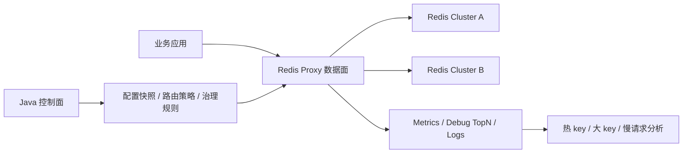

# Redis Proxy

Redis Proxy 是一个面向基础架构场景的 Redis 访问入口项目。目标不是只做透明转发，而是在低尾延迟数据面的基础上，把 Redis 集群调度、访问治理、观测分析和研发接入规范沉淀成统一能力。

## 项目结构

当前工作区保留三个独立工程：

- `redis-proxy-dataplane-go`：Go 数据面，作为低尾延迟和低资源开销的主验证方向。
- `redis-proxy-dataplane-java`：Java 21 + Netty 数据面，用于同等能力下对比尾延迟、GC、内存和吞吐。
- `redis-proxy-control-plane-java`：Java 21 + Spring Boot 控制面，负责配置模型、路由策略、治理规则、发布治理和观测聚合。

## 核心目标

- 对业务隐藏 Redis standalone / cluster / 多集群拓扑差异。
- 支持数据面无状态横向扩容。
- 支持 route snapshot 动态切换、灰度切流、快速回滚和多 proxy 收敛观测。
- 支持 namespace 鉴权、命令治理、key 治理、限流和审计扩展。
- 支持热 key、大 key、大 response、慢请求等访问特征分析。
- 保持低 p99 / p999 尾延迟，避免代理层成为 Redis 访问瓶颈。

非目标：

- 不在数据面承载复杂审批流、报表和策略编排。
- 不在首版实现完整 Redis Server 能力治理，例如完整 Lua / MULTI / PUBSUB 语义拦截。
- 不把热 key / 大 key 离线分析强塞进同步请求路径。

## 总体架构



数据面负责 RESP2 解析、连接管理、pipeline 顺序保持、backend 连接池、slot 路由、MOVED/ASK 处理、治理限流和低基数 metrics。控制面负责配置建模、版本发布、灰度回滚、观测 target 管理和后续双活切换编排。

## 当前能力概览

- 双数据面：Go async backend 与 Java Netty async backend，能力口径保持对齐。
- Redis Cluster 路由：支持 `CLUSTER SLOTS` 刷新、MOVED 单 slot 更新、ASKING 临时路由、degraded refresh 和真实 `/readyz`。
- 动态路由：支持 `routeEpoch` 原子切换、长轮询发布、namespace / key pattern / hash tag 路由、百分比灰度和基于更大 epoch 的回滚。
- 整集群切换：控制面支持一键全量切换和分阶段灰度切换，用于机器迁移、上下云和机房搬迁。
- 多 proxy 收敛：通过 `routeEpoch + configHash + proxyId` 判断每台数据面是否应用同一配置。
- 治理能力：支持 `AUTH <namespace> <token>`、命令治理、只读 namespace、allowed key prefix、namespace 限流、key 禁用和 key rule 滑动窗口限流。
- 观测分析：支持热 key TopK、大 key、大 response、慢查询 TopN、控制面 Collector 和本地巡检报告。
- Pipeline：Go / Java 都支持 client response sequencer、pipeline depth 硬限制、batch flush、HOL 观测和 backend affinity 策略。

## 快速启动

启动 Redis standalone：

```bash
./scripts/redis-standalone-up.sh
```

启动 Go 数据面：

```bash
./scripts/run-go-dataplane.sh standalone
```

启动 Java 数据面：

```bash
./scripts/run-java-dataplane.sh standalone g1
```

执行 smoke：

```bash
./scripts/smoke.sh
```

更多本地运行、E2E 和 benchmark 命令见 [local-runbook.md](docs/local-runbook.md)。

## 文档索引

核心设计：

- [统一配置契约](docs/config-reference.md)
- [路由与集群调度](docs/routing-and-cluster-scheduling.md)
- [Redis Backend 异常与 Slot 刷新机制](docs/backend-resilience.md)
- [治理与观测能力](docs/governance-and-observability.md)
- [Pipeline 处理机制](docs/pipeline-processing.md)

实验与性能：

- [尾延迟对比工作区](docs/tail-latency-comparison-workspace.md)
- [性能专项：协议解析与少拷贝转发优化](docs/performance-optimization-plan.md)
- [TCP 应用与 Kafka / RocketMQ 零拷贝差异](docs/zero-copy-networking-notes.md)
- [Sliding Window Limiter 实现说明](docs/sliding-window-limiter.md)

工程操作：

- [本地运行与验证手册](docs/local-runbook.md)
- [实现路线与阶段状态](docs/roadmap.md)

## 当前阶段

当前项目已经完成透明代理 MVP、异步 backend、Redis Cluster 路由韧性、动态 route snapshot、发布治理、namespace/key 治理、热 key / 大 key / 慢查询本地观测、控制面 Collector 和 pipeline 后续优化。下一阶段重点是：

1. 控制面配置数据库持久化后的生产化校准。
2. Java / Go RESP offset parser 和少拷贝转发专项。
3. 长稳 benchmark、direct memory / heap 深度指标和生产级报告模板。
4. 双活切换策略建模、审批流和跨实例治理观测聚合。
