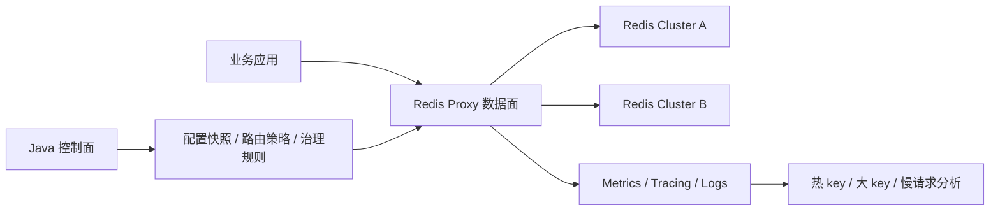

# Redis Proxy 技术方案与实现路线

本项目用于设计和验证一套面向基础架构场景的 Redis Proxy。目标不是简单做透明转发，而是在数据面稳定低延迟的前提下，把 Redis 集群调度、访问治理、观测分析和研发接入规范沉淀到统一入口。

当前工作区保留三套独立工程：

- `redis-proxy-dataplane-go`：Go 数据面，当前作为低尾延迟和低资源开销的主验证方向。
- `redis-proxy-dataplane-java`：Java 21 + Netty 数据面，用于和 Go 在同等能力下做尾延迟、GC、内存和吞吐对比。
- `redis-proxy-control-plane-java`：Java 21 + Spring Boot 控制面，负责配置模型、路由策略、治理规则和后续运维编排。

尾延迟实验工作区说明已独立到 [tail-latency-comparison-workspace.md](docs/tail-latency-comparison-workspace.md)。

## 设计目标

核心目标：

- 对业务隐藏 Redis standalone / cluster / 多集群拓扑差异。
- 支持数据面无状态横向扩容。
- 支持同城双活、自主切换和后续跨机房容灾编排。
- 支持统一鉴权、namespace、限流、命令治理和审计。
- 支持热 key、大 key、大 response、慢请求等访问特征分析。
- 保持低 p99 / p999 尾延迟，避免代理层成为 Redis 访问瓶颈。
- 简化研发接入，形成统一 Redis 使用规范。

非目标：

- 不在数据面承载复杂审批流、报表和策略编排。
- 不在首版实现完整 Redis Server 能力治理，例如完整 Lua / MULTI / PUBSUB 语义拦截。
- 不把热 key / 大 key 离线分析强塞进同步请求路径。

## 总体架构



数据面负责：

- RESP2 请求解析和原始响应转发。
- 连接管理、pipeline 顺序保持、backend 连接池。
- slot 路由、MOVED / ASK 基础处理。
- 快速限流、基础鉴权、命令治理。
- metrics、healthz、readiness、graceful shutdown。

控制面负责：

- cluster / namespace / route / limits 配置建模。
- 生成数据面本地不可变配置快照。
- 管理 routeEpoch 和切换策略。
- 后续扩展审批、发布、灰度、回滚和双活切换编排。

## 数据面技术路线

当前保留 Go 和 Java 双数据面，功能语义对齐后做同口径对比。

Go 数据面：

- 使用标准 `net` + goroutine 模型。
- backend 采用异步连接池，每条 backend 连接维护 FIFO inflight 队列。
- client response sequencer 保证 pipeline 响应顺序。
- 当前本地 benchmark 中，Go async 在同组 async backend 对比里吞吐和 p99 都优于 Java async。

Java 数据面：

- 使用 Java 21 + Spring Boot + Netty。
- Netty 负责前端 TCP 和 backend TCP，不使用 Lettuce/Jedis 进入核心链路。
- 重点验证 direct memory、ByteBuf 生命周期、G1GC / ZGC 下尾延迟差异。
- 当前作为 Java 技术栈下的数据面对照实现，不代表最终生产路线结论。

Rust 路线：

- 暂不进入首轮实现。
- 后续如果 Go / Java 在 p999、内存占用或 CPU 利用率上无法满足目标，再评估 Rust 数据面。
- Rust 适合极致性能和内存控制，但工程团队学习成本、生态集成和迭代效率需要单独评估。

## 路由与集群调度

首版路由能力：

- standalone 单 Redis 转发。
- Redis Cluster slot 计算。
- 简化 slot 到节点映射。
- MOVED / ASK 指标暴露。

后续路线：

1. 接入真实 `CLUSTER SLOTS` 拓扑刷新。
2. 支持 routeEpoch，本地不可变路由快照。
3. 支持按 namespace / key pattern / hash tag 路由到不同集群。
4. 支持灰度切流、按比例切流和快速回滚。
5. 支持同城双活场景下的主读写集群切换。

同城双活建议把“决策”和“执行”分离：

- 控制面负责健康判断、切换计划、审批或自动化策略。
- 数据面只消费已发布的路由快照，按 routeEpoch 原子切换。
- 切换期间优先保证请求路径简单、确定、可观测。

## 治理能力

第三阶段第一批已落地治理 MVP：Go / Java 数据面都支持 `AUTH <namespace> <token>` 绑定连接身份，治理开启后未认证请求默认返回 `NOAUTH`，并在本地快照中执行命令治理、只读 namespace 和可选 key prefix 约束。

已实现边界：

- 接入治理：namespace、应用身份、Redis 资源绑定关系。
- 访问控制：命令黑白名单、只读 namespace、危险命令拦截。
- 命令策略：默认拒绝 `FLUSHALL`、`FLUSHDB`、`CONFIG`、`SHUTDOWN`、`DEBUG`、`MODULE`；`KEYS`、`EVAL`、`SCRIPT` 第一版只打点不拒绝。
- key 约束：namespace 可配置 `allowedKeyPrefixes`，为空表示不限制；非空时只允许已支持命令的 key 位置全部匹配前缀。
- 动态生效：治理规则纳入 route snapshot，控制面发布更大 `routeEpoch` 后随长轮询原子切换。
- 观测：数据面暴露 auth、governance reject 和 governance warn 指标；`/debug/route-snapshot` 只返回治理摘要，不暴露 token。

后续治理能力分层：

- 限流降级：连接数、QPS、pipeline depth、inflight、请求大小、响应大小。
- 热 key 分析：在数据面做轻量采样和 TopK 近实时统计，重分析放异步链路。
- 大 key / 大 response 分析：同步路径只做大小计数、阈值打点和采样，离线分析由旁路任务完成。
- 审计：高风险命令、跨 namespace 访问、切换操作和异常流量记录。

热 key 和大 key 可以在 Proxy 层做，但需要控制边界：

- 可以做：采样、计数、TopK、阈值告警、按 namespace 聚合。
- 不建议在同步路径做：全量精确统计、复杂聚合、阻塞式大 key 扫描。
- 大 key 更准确的判断应结合 Redis 侧 `MEMORY USAGE`、离线扫描和 response size 观测。

## 统一配置契约

Go / Java 数据面和 Java 控制面共享同一语义配置。

```yaml
server:
  listen: "0.0.0.0:6379"

admin:
  listen: "0.0.0.0:8080"

mode: "cluster"

backends:
  clusters:
    - name: "redis-a"
      nodes:
        - "127.0.0.1:7000"
        - "127.0.0.1:7001"
        - "127.0.0.1:7002"
      pool:
        connectionsPerNode: 16
        maxInflightPerConnection: 4096
    - name: "redis-b"
      nodes:
        - "127.0.0.1:7100"
        - "127.0.0.1:7101"
        - "127.0.0.1:7102"
      pool:
        connectionsPerNode: 16
        maxInflightPerConnection: 4096

routing:
  defaultCluster: "redis-a"
  routeEpoch: 1
  clusterSlotsRefreshIntervalSeconds: 30
  rules:
    - name: "gray-user-cache"
      cluster: "redis-b"
      keyPrefix: "user:"
      trafficPercent: 10

limits:
  maxPipelineDepth: 1024
  maxRequestBytes: 10485760
  maxResponseBytes: 104857600
  largeResponseBytes: 1048576

analysis:
  hotKey:
    enabled: true
    windowSeconds: 60
    bucketMillis: 1000
    maxTrackedKeys: 10000
    metricsTopN: 20
  largeKey:
    enabled: true
    requestBytesThreshold: 1048576
    responseBytesThreshold: 1048576
    windowSeconds: 300
    bucketMillis: 1000
    maxTrackedKeys: 10000
    debugTopN: 100

controlPlane:
  enabled: false
  url: "http://127.0.0.1:8090/api/v1/config"
  pollIntervalSeconds: 5
  watchTimeoutSeconds: 30
  requestTimeoutMillis: 1000

governance:
  enabled: false
  requireAuth: true
  keyLimitWindowMillis: 1000
  keyLimitBucketMillis: 100
  commandPolicy:
    deniedCommands: ["FLUSHALL", "FLUSHDB", "CONFIG", "SHUTDOWN", "DEBUG", "MODULE"]
    warnOnlyCommands: ["KEYS", "EVAL", "SCRIPT"]
  namespaces:
    - name: "app-a"
      token: "token-a"
      readOnly: false
      allowedKeyPrefixes: ["app-a:"]
      deniedCommands: []
      warnOnlyCommands: []
      limits:
        maxConnections: 0
        maxQps: 0
        maxInflight: 0
      disabledKeys: ["app-a:blocked"]
      keyRules:
        - name: "hot-user"
          keyPrefix: "app-a:hot:"
          disabled: false
          maxQps: 1000
```

配置原则：

- 启动强校验，非法配置 fail fast。
- 数据面运行时使用本地不可变快照。
- `routeEpoch` 表示当前路由快照版本；数据面按快照进行原子路由选择，不在单请求中混用多个版本。
- `routing.rules` 按顺序匹配，支持 `keyPrefix` / `hashTag` 和稳定百分比灰度，未命中时回到 `defaultCluster`。
- 控制面生成同结构配置；开启 `controlPlane.enabled` 后，数据面通过 `/api/v1/config/watch` 长轮询消费新快照。
- `controlPlane.pollIntervalSeconds` 在长轮询模式下表示异常后的重试间隔；正常无变更时控制面返回 `204`，数据面立即续订下一次 watch。
- `controlPlane.watchTimeoutSeconds` 表示单次 watch 的服务端等待窗口；`requestTimeoutMillis` 是客户端请求超时余量。
- `governance.enabled=false` 时数据面保持透明代理；开启后，`AUTH <namespace> <token>` 由 proxy 本地处理并绑定连接身份，不转发给 Redis。
- `governance.requireAuth=true` 时，除 `AUTH` / `QUIT` 外的未认证请求返回 `-NOAUTH Authentication required`。
- namespace 维度支持连接数、秒级 QPS 和 inflight 限制；`0` 表示不限制。
- key 维度支持精确禁用 `disabledKeys` 和按 `keyPrefix` / `hashTag` 匹配的 `keyRules`；`maxQps` 使用本地滑动窗口计数，默认 `1000ms / 100ms`。
- 滑动窗口限流算法的实现、过期 bucket 清理逻辑和 ring buffer 对比见 [Sliding Window Limiter 实现说明](docs/sliding-window-limiter.md)。
- 启用 key 治理时，多 key 命令任意 key 命中禁用或限流都会拒绝整个请求；无法识别 key 位置的命令 fail closed。
- 治理指标按 Go Prometheus 命名和 Java Micrometer 命名分别暴露，语义保持一致：auth、治理拒绝/告警、namespace 当前连接和 inflight、namespace 配置限额和限流拒绝、key rule 决策、key 限额配置和滑动窗口用量。
- namespace token 第一版以明文配置和发布，控制面版本历史会保存完整配置；平台化阶段再接密钥管理。
- `limits.largeResponseBytes`、`analysis.hotKey.*`、`analysis.largeKey.*`、`analysis.slowQuery.*` 均纳入控制面发布模型；数据面接受更大 `routeEpoch` 后会随 route snapshot 生效。
- 所有切换和治理规则必须可审计、可回滚。

核心治理指标：

| 语义 | Go 指标 | Java 指标 |
| --- | --- | --- |
| AUTH 结果 | `redis_proxy_auth_total{namespace,result}` | `redis.proxy.auth{namespace,result}` |
| 治理拒绝 | `redis_proxy_governance_reject_total{namespace,command,reason}` | `redis.proxy.governance.reject{namespace,command,reason}` |
| 治理告警 | `redis_proxy_governance_warn_total{namespace,command,reason}` | `redis.proxy.governance.warn{namespace,command,reason}` |
| namespace 连接数 | `redis_proxy_namespace_connections{namespace}` | `redis.proxy.namespace.connections{namespace}` |
| namespace inflight | `redis_proxy_namespace_inflight{namespace}` | `redis.proxy.namespace.inflight{namespace}` |
| namespace 限额配置 | `redis_proxy_namespace_limit_config{namespace,limit}` | `redis.proxy.namespace.limit.config{namespace,limit}` |
| namespace 限流拒绝 | `redis_proxy_namespace_limit_reject_total{namespace,limit}` | `redis.proxy.namespace.limit.reject{namespace,limit}` |
| key 治理拒绝 | `redis_proxy_key_governance_reject_total{namespace,rule,command,reason}` | `redis.proxy.key.governance.reject{namespace,rule,command,reason}` |
| key rule 决策 | `redis_proxy_key_governance_decisions_total{namespace,rule,command,result,reason}` | `redis.proxy.key.governance.decisions{namespace,rule,command,result,reason}` |
| key 限额配置 | `redis_proxy_key_limit_config{namespace,rule}` | `redis.proxy.key.limit.config{namespace,rule}` |
| key 滑窗用量 | `redis_proxy_key_limit_window_usage{namespace,rule}` | `redis.proxy.key.limit.window.usage{namespace,rule}` |

热 key 观测：

- Go / Java 数据面都会在治理通过、进入路由前，对已支持 key 解析的命令做本地滑动窗口计数。
- TopK 默认统计最近 60s 窗口，bucket 粒度 1s；可通过 `analysis.hotKey.windowSeconds` / `bucketMillis` 调整，过期 key 会在观测或 debug 查询时被清理。
- 进程内默认最多跟踪 10000 个 `namespace + command + key` 组合，可通过 `analysis.hotKey.maxTrackedKeys` 调整；超过上限的新 key 会被跳过并计入 dropped 指标。
- `/debug/hot-keys?limit=20` 返回当前进程内 TopK 明细。
- metrics 默认只暴露 Top 20，可通过 `analysis.hotKey.metricsTopN` 调整，避免把全量 key 写入高基数 label。

| 语义 | Go 指标 | Java 指标 |
| --- | --- | --- |
| 已观测 key 数 | `redis_proxy_hot_key_observed_total{namespace,command}` | `redis.proxy.hot.key.observed{namespace,command}` |
| 容量满后丢弃数 | `redis_proxy_hot_key_dropped_total{namespace,command}` | `redis.proxy.hot.key.dropped{namespace,command}` |
| 当前跟踪 key 数 | `redis_proxy_hot_key_tracked_keys` | `redis.proxy.hot.key.tracked.keys` |
| TopK 计数 | `redis_proxy_hot_key_topk_count{namespace,command,key,rank}` | `redis.proxy.hot.key.topk.count{namespace,command,key,rank}` |

大 key 观测：

- Go / Java 数据面都会在治理通过后复用治理 key parser 做本地大 key 归因，维度为 `namespace + command + key`。
- `requestBytesThreshold` 和 `responseBytesThreshold` 默认 1MB；请求或最终响应超过阈值时才进入大 key 窗口统计，不拦截请求。
- 窗口默认 300s，bucket 粒度 1s；`maxTrackedKeys` 控制进程内最多跟踪的组合数量，容量满后的新 key 计入 dropped 指标。
- 多 key 命令暂按完整请求/响应大小归因到每个可解析 key；无法识别 key 位置的命令不影响转发，只计入 unsupported。
- `/debug/large-keys?limit=100` 返回当前进程 TopN 明细，按 `max(requestBytes,responseBytes)` 降序。
- Prometheus / Micrometer 只暴露低基数指标，不把真实 key 写入 metrics label，避免大规模 key 造成高基数风险。

| 语义 | Go 指标 | Java 指标 |
| --- | --- | --- |
| 大 key 观测次数 | `redis_proxy_large_key_observed_total{namespace,command,direction}` | `redis.proxy.large.key.observed{namespace,command,direction}` |
| 容量满后丢弃数 | `redis_proxy_large_key_dropped_total{namespace,command}` | `redis.proxy.large.key.dropped{namespace,command}` |
| 无法归因命令数 | `redis_proxy_large_key_unsupported_total{command,direction}` | `redis.proxy.large.key.unsupported{command,direction}` |
| 当前跟踪 key 数 | `redis_proxy_large_key_tracked_keys` | `redis.proxy.large.key.tracked.keys` |
| 请求阈值 | `redis_proxy_large_key_request_threshold_bytes` | `redis.proxy.large.key.request.threshold.bytes` |
| 响应阈值 | `redis_proxy_large_key_response_threshold_bytes` | `redis.proxy.large.key.response.threshold.bytes` |

慢查询观测：

- Go / Java 数据面都会在最终响应按 pipeline 顺序写回前记录慢查询，维度为 `namespace + command + key`。
- 慢查询同时记录两个口径：端到端延迟是 proxy 收到请求到写回前，backend 延迟是请求进入 backend pool 到最终 backend 响应或错误完成，`ASKING` retry 计入同一次 backend 耗时。
- 默认阈值为端到端 100ms、backend 50ms；窗口默认 300s，bucket 粒度 1s，容量默认 10000。
- `/debug/slow-queries?limit=100` 返回当前进程 TopN 明细，包含 `maxEndToEndMillis` 和 `maxBackendMillis`。
- Prometheus / Micrometer 只暴露低基数指标，不把真实 key 写入 metrics label。

| 语义 | Go 指标 | Java 指标 |
| --- | --- | --- |
| 慢查询观测次数 | `redis_proxy_slow_query_observed_total{namespace,command,trigger}` | `redis.proxy.slow.query.observed{namespace,command,trigger}` |
| 容量满后丢弃数 | `redis_proxy_slow_query_dropped_total{namespace,command}` | `redis.proxy.slow.query.dropped{namespace,command}` |
| 无法归因命令数 | `redis_proxy_slow_query_unsupported_total{command}` | `redis.proxy.slow.query.unsupported{command}` |
| 当前跟踪 key 数 | `redis_proxy_slow_query_tracked_keys` | `redis.proxy.slow.query.tracked.keys` |
| 端到端阈值 | `redis_proxy_slow_query_end_to_end_threshold_millis` | `redis.proxy.slow.query.end.to.end.threshold.millis` |
| backend 阈值 | `redis_proxy_slow_query_backend_threshold_millis` | `redis.proxy.slow.query.backend.threshold.millis` |

大 response 观测：

- `maxResponseBytes` 是硬上限，超过后 backend frame 读取失败并返回 backend unavailable。
- `largeResponseBytes` 是软阈值，默认 1MB；超过只打指标，不拦截请求；控制面发布更大 `routeEpoch` 后可动态调整。
- 统计发生在最终响应写回客户端前，`ASKING` 的中间 `+OK` 不计入最终业务响应。

| 语义 | Go 指标 | Java 指标 |
| --- | --- | --- |
| 响应大小分布 | `redis_proxy_response_bytes{command}` | `redis.proxy.response.bytes{command}` |
| 大 response 命中 | `redis_proxy_large_response_total{command}` | `redis.proxy.large.response{command}` |
| 大 response 阈值 | `redis_proxy_large_response_threshold_bytes` | `redis.proxy.large.response.threshold.bytes` |

## 本地运行

启动 Redis standalone：

```bash
./scripts/redis-standalone-up.sh
```

启动 Go 数据面：

```bash
./scripts/run-go-dataplane.sh standalone
```

启动 Go 数据面连接本地 Redis Cluster：

```bash
./scripts/run-go-dataplane.sh cluster
```

如果本机 `7000-7005` 端口被占用，可以使用备用端口配置：

```bash
REDIS_CLUSTER_PORTS="7100 7101 7102 7103 7104 7105" ./scripts/redis-cluster-up.sh
./scripts/run-go-dataplane.sh cluster-local
REDIS_CLUSTER_PORTS="7100 7101 7102 7103 7104 7105" ./scripts/redis-cluster-down.sh
```

启动 Java 数据面：

```bash
./scripts/run-java-dataplane.sh standalone g1
./scripts/run-java-dataplane.sh standalone zgc
```

执行 smoke：

```bash
./scripts/smoke.sh
```

执行治理 E2E：

```bash
./scripts/e2e-governance.sh go
./scripts/e2e-governance.sh java
```

执行动态观测配置 E2E：

```bash
./scripts/e2e-observability-config.sh go
./scripts/e2e-observability-config.sh java
```

生成治理与观测巡检报告：

```bash
./scripts/generate-governance-observability-report.py \
  --admin-url http://127.0.0.1:8080 \
  --output-dir reports/governance-observability-local
```

报告会输出 `report.md`、`summary.json`、`metrics.prom`、`route-snapshot.json`、`hot-keys.json` 和 `large-keys.json`。这是单 proxy 进程的本地快照，用于巡检和压测上下文记录，不代表跨实例全局聚合结论。

执行治理与观测报告 E2E：

```bash
./scripts/e2e-governance-observability-report.sh go
./scripts/e2e-governance-observability-report.sh java
```

执行控制面治理观测 Collector E2E：

```bash
./scripts/e2e-observability-collector.sh go
./scripts/e2e-observability-collector.sh java
```

执行 benchmark：

```bash
REQUESTS=20000 CLIENTS_LIST="50 200" PIPELINE_LIST="1 10 100" TESTS="set,get" ./scripts/bench.sh
```

使用固定 benchmark profile：

```bash
./scripts/bench-profile.sh smoke proxy
./scripts/bench-profile.sh baseline proxy
./scripts/bench-profile.sh long proxy
./scripts/bench-profile.sh baseline redis-direct
```

profile 语义：

- `smoke`：1000 请求，10 连接，pipeline 1，用于快速验证脚本和资源采集。
- `baseline`：20000 请求，50/200 连接，pipeline 1/10/100，用于本地工程基线。
- `long`：1000000 请求，50/200 连接，pipeline 1/10/100，用于长稳 p99/p999 观察。

执行带资源采集的 benchmark：

```bash
BENCH_TARGET_PID=<proxy-pid> \
BENCH_TARGET_LABEL=go-async \
BENCH_ADMIN_URL=http://127.0.0.1:8080 \
REQUESTS=20000 CLIENTS_LIST="50 200" PIPELINE_LIST="1 10 100" TESTS="set,get" \
./scripts/bench.sh
```

Java 数据面可以额外带上 GC log：

```bash
BENCH_TARGET_PID=<java-pid> \
BENCH_TARGET_LABEL=java-g1-async \
BENCH_ADMIN_URL=http://127.0.0.1:8080 \
BENCH_JAVA_GC_LOG=redis-proxy-dataplane-java/target/gc-g1.log \
./scripts/bench.sh
```

执行直连 Redis baseline：

```bash
REQUESTS=20000 CLIENTS_LIST="50 200" PIPELINE_LIST="1 10 100" TESTS="set,get" ./scripts/bench-direct-redis.sh
```

从多个 benchmark 结果目录生成 Markdown 对比报告：

```bash
./scripts/generate-bench-report.py \
  --title "Redis Proxy Async Backend Comparison" \
  --output bench-results/comparison-$(date +%Y%m%d-%H%M%S).md \
  bench-results/redis-direct-standalone-xxx \
  bench-results/go-async-standalone-xxx \
  bench-results/java-g1-async-standalone-xxx
```

## 验证口径

数据面正确性：

- `PING` / `GET` / `SET` / `DEL`
- pipeline 响应顺序
- 大 value 转发
- 连接关闭与超时
- Redis Cluster slot 计算
- MOVED / ASK 指标
- healthz / readiness / metrics
- graceful shutdown

性能对比：

- 相同 Redis 后端。
- 相同 proxy 配置。
- 相同 client workload。
- 相同机器资源限制。
- 相同并发连接数和 pipeline depth。
- 区分 sync backend 和 async backend 实现模型。
- 同时采集 RPS、p50、p95、p99、p999、CPU、RSS、GC、heap/direct memory、backend inflight 和 error rate。

当前 benchmark 详情见 [tail-latency-comparison-workspace.md](docs/tail-latency-comparison-workspace.md)。

## Redis Backend 异常与 Slot 刷新机制

Backend 到 Redis 集群的异常处理遵循三个原则：

- 快速失败请求，不让 client pipeline 长时间挂起。
- 后台温和修复连接，不在请求路径上无限重试。
- 依赖 Redis Cluster 拓扑信号恢复路由，不因为 TCP 断开直接改 slot owner。

连接异常处理：

- `connect refused`、`connect timeout`、`read EOF`、`write error`、`channel inactive` 都只表示某条 backend connection 不可用。
- backend connection 断开后，当前连接上的 pending 请求快速失败，并继续按 client sequence 占位返回，保证 pipeline 响应顺序不被破坏。
- 已写入 socket 或执行状态不确定的请求不自动重放，避免写命令重复执行。
- backend pool 在后台按退避策略重连，并按原连接槽位替换，保留同一 client/backend 的连接亲和。
- 某个 Redis node 全部连接不可用时，只影响该 node 当前负责的 slot；proxy 不把这些 slot 随机路由到其他 master。
- 动态配置发布时，backend pool 以 Redis node address 为粒度增量 `ensure`：新快照新增的 node 会提前建连接，已存在的 node 不重建连接池。
- 新快照不再引用的旧 node 当前不会立即关闭，避免打断已基于旧 route snapshot 发出的在途请求；后续需要实现 `retired + drain timeout` 的连接回收。

Slot cache 刷新策略：

- TCP 连接断开不触发 slot owner 变更，也不清空 slot cache。
- `MOVED` 是长期拓扑变化信号：立即更新对应单 slot，并触发一次限频异步 `CLUSTER SLOTS` 全量刷新。
- `ASK` 是迁移过程中的临时信号：只做临时转发，不更新长期 slot cache。
- 正常周期刷新默认 30 秒，由 `routing.clusterSlotsRefreshIntervalSeconds` 控制。
- 当某个 master 进入 degraded 状态，例如该 master 全部 backend connection 不可用时，拓扑刷新临时加速到 5 秒；恢复后回到正常周期。
- `CLUSTER SLOTS` 刷新失败时保留旧 slot cache，记录 refresh error，不清空路由表。

健康检查口径：

- `/healthz` 只表示 proxy 进程存活。
- `/readyz` 用于表达数据面是否可承接流量，应检查 slot coverage、backend 可用性和连接池状态。
- 单 master 故障时，proxy 不应整体不可用；对应 slot 快速失败，其他 slot 继续服务。

核心指标口径：

- `backend_active_connections{node}`：按 Redis node 统计健康 backend 连接数。
- `backend_desired_connections{node}`：按 Redis node 统计期望 backend 连接数。
- `backend_reconnecting{node}`：按 Redis node 统计正在调度或执行的重连任务。
- `backend_reconnect_total{node,result}`：按 Redis node 和结果统计重连次数。
- `backend_unavailable_total{node,reason}`：按 Redis node 和原因统计 backend 不可用。
- `backend_inflight{node}`：按 Redis node 统计后端 inflight 请求。
- `ask_redirect_total{result}`：按结果统计 `ASKING` 临时路由重试，`success` 表示透明转发成功，`error` 表示临时 owner 不可用，`loop_prevented` 表示二次 ASK 被直接返回客户端。
- `cluster_slot_coverage`：slot cache 覆盖数量，正常应为 16384。
- `cluster_slot_refresh_total{result}`：`CLUSTER SLOTS` 刷新成功和失败次数。

## 后续实现步骤

第一阶段：工程基线收敛

状态：进行中。

已完成：

1. Go / Java 数据面的基础单元测试和 smoke 脚本。
2. Go async / Java async 同组 benchmark 基线。
3. 直连 Redis baseline 脚本入口：`scripts/bench-direct-redis.sh`。
4. benchmark 结果报告生成脚本：`scripts/generate-bench-report.py`。
5. benchmark 基础资源采集：CPU、RSS、线程数、admin metrics 快照、Java GC log 摘要。
6. benchmark profile 脚本：`smoke`、`baseline`、`long`。
7. Go runtime metrics：heap、goroutine、process collector，并进入 benchmark 报告。
8. p999 近似采集：long profile 会额外采集 Redis benchmark percentile distribution，并取第一个大于等于 99.9% 的桶。

待完成：

1. Java Netty direct memory 深度指标校准和验证。
2. 固化生产级 benchmark 报告模板和长稳结论口径。

第二阶段：生产级路由

状态：核心能力已完成。`routeEpoch` 原子切换、灰度路由和回滚不纳入本阶段收敛，保留到后续路由发布阶段。

已完成：

1. Go 数据面启动时通过 `CLUSTER SLOTS` 构建 slot cache。
2. Go 数据面按真实 slot cache 路由，不再只使用 `slot % len(nodes)` 简化映射。
3. Go 数据面遇到 `MOVED` 响应时更新单 slot cache，并按需初始化新 backend 连接。
4. Go 数据面支持周期性 `CLUSTER SLOTS` 拓扑刷新，可通过 `routing.clusterSlotsRefreshIntervalSeconds` 配置，`0` 表示关闭。
5. Go 数据面暴露 slot cache 覆盖度、routeEpoch、slot refresh 成功/失败次数和最近成功刷新时间指标。
6. Java 数据面已对齐 `CLUSTER SLOTS` slot cache、周期刷新配置、MOVED 单 slot 更新和路由状态指标。
7. Java 数据面同一 client 到同一 backend 使用稳定后端连接亲和，避免依赖型 pipeline 在多后端连接间执行乱序。
8. Go 数据面同一 client 到同一 backend 也使用稳定后端连接亲和，并补充单元测试锁定该语义。
9. Go 数据面 backend connection 断开后会后台持续重连，并按原连接槽位替换，保留 client/backend 亲和语义。
10. Java 数据面 backend connection 断开后会由独立 scheduler 后台持续重连，限制全局和单 node 重连并发，并按原连接槽位替换。
11. Go / Java 数据面均对齐 Redis backend 异常、`MOVED`、`ASK`、master degraded 和 slot cache 刷新的处理语义。
12. Go / Java 数据面均实现真实 `/readyz`：standalone 检查默认 backend 可用，cluster 检查 slot coverage 和当前 slot owner backend 可用性。
13. Go / Java 数据面均补齐 per-node backend active / desired / reconnecting / reconnect / unavailable / inflight 指标口径。
14. 已完成 Go / Java standalone 停启恢复 E2E：Redis 停止时请求快速失败，Redis 恢复后 proxy 不重启恢复服务。
15. 已完成 Go / Java `7100-7105` cluster-local smoke、master 故障、Redis Cluster failover 和 degraded refresh E2E。
16. 已补充单元测试覆盖 `ASK` 不污染长期 slot cache、`MOVED` refresh 限频触发、backend reconnect 指标不为负和连接槽位替换。
17. Go / Java 数据面已支持 `ASKING` 临时路由：收到 `ASK` 后向临时 owner 同连接发送 `ASKING` + 原请求，跳过 `+OK` 后把真实响应返回客户端，且不污染长期 slot cache。

第二阶段后半：路由发布基础

状态：长轮询式动态路由快照发布已完成；显式回滚、发布审计和灰度发布平台化仍待实现。

已完成：

1. Go / Java 数据面和 Java 控制面均支持统一 `routing.rules` 配置模型。
2. `routing.rules` 支持按 `keyPrefix` / `hashTag` 匹配，并通过 key 的稳定 hash 做百分比灰度切流。
3. Go / Java 数据面均支持多 backend cluster 的路由选择；命中灰度规则时路由到规则指定 cluster，否则回到 `defaultCluster`。
4. cluster 模式下，Go / Java 数据面会按参与路由的 cluster 维护 slot cache 和 readiness 判断。
5. 控制面校验 route rule 引用的 cluster、流量百分比和 key 匹配条件，避免生成不可执行配置。
6. 单元测试已覆盖 Go / Java 灰度路由选择和控制面 route rule 合法性校验。
7. Java 控制面提供 `GET /api/v1/config/watch?epoch=<current>&timeoutSeconds=<n>` 长轮询接口；无更新返回 `204`，有更大 `routeEpoch` 立即返回新配置。
8. Go / Java 数据面均从控制面长轮询 route snapshot，只接受单调递增的 `routeEpoch`，并用原子快照替换保证单请求只读一个版本。
9. Go / Java 数据面新增 `/debug/route-snapshot`，可查看当前生效 epoch、defaultCluster、rules 和参与路由的 clusters。
10. Go / Java 数据面新增 route epoch、snapshot update/reject、last success timestamp 和 route decision 指标。
11. 已完成动态切换 E2E：发布 epoch=2 后，Go / Java 均无需等待固定 poll interval 即切换快照，`user:*` 路由到 `redis-b`，默认 key 保持 `redis-a`。
12. Java 控制面提供显式发布治理 API：`POST /api/v1/config/publish`、`POST /api/v1/config/rollback`、版本历史、版本详情、diff 和 route status 查询。
13. 控制面发布历史记录 versionId、routeEpoch、operator、reason、action、approvalStatus 和完整 config snapshot。
14. 回滚采用更大 `routeEpoch` 表达：复制历史版本内容并设置为 `currentEpoch + 1`，不会要求数据面接受旧 epoch。
15. 控制面 `/api/v1/routes/status` 提供当前发布期望态；灰度真实命中量仍以数据面 Prometheus route decision 指标为准。
16. 已固化 `scripts/e2e-dynamic-route.sh`、`scripts/e2e-asking.sh` 和 `scripts/e2e-cluster-failover.sh`。

待完成：

1. 将控制面版本历史和审计记录从内存态迁移到持久化存储。
2. 接入真实审批流，使 `approvalStatus` 从审计字段升级为发布阻断条件。
3. 接入 Prometheus 查询或报表服务，在控制面聚合展示灰度真实命中量。
4. 为动态路由删除的 backend node 增加 retired 标记、inflight drain 和超时关闭，避免长期残留旧连接池。

第三阶段：治理能力

状态：第一批治理 MVP 已完成，namespace / key 级本地治理限流已进入实现收敛；热 key 与大 key 的本地分析 MVP 已落地，后续进入更细粒度指标联动和报告化。

已完成：

1. Go / Java 数据面支持 `AUTH <namespace> <token>`，按连接绑定 namespace。
2. 治理开启后默认未认证拒绝，支持 namespace 删除后的 `NOAUTH namespace disabled` 语义。
3. 支持全局和 namespace 级危险命令拦截、warn-only 命令打点、只读 namespace。
4. 支持 namespace 可选 `allowedKeyPrefixes`，对未知 key 位置命令 fail closed。
5. 控制面 `ProxyConfig`、publish、rollback、diff 和 status 支持 governance 配置。
6. 治理规则随 route snapshot 长轮询动态生效，Go / Java 均有 `e2e-governance.sh` 覆盖。
7. 支持 namespace 维度连接数、QPS、inflight 限制。
8. 支持 key 精确禁用、keyPrefix/hashTag 规则禁用，以及基于滑动窗口的 key rule QPS 限流。
9. 补齐治理与限流可观测性：配置限额、当前连接/inflight、限流拒绝、key rule 决策和滑动窗口用量。
10. 支持本地进程级热 key TopK 轻量采样，基于 60s 滑动窗口，提供 debug 查询和低基数 TopK 指标。
11. 支持大 response 软阈值观测，记录响应大小分布和超过阈值的命中次数。
12. `largeResponseBytes`、热 key 窗口、容量和 metrics TopN 已配置化，并随控制面 route snapshot 动态生效。
13. 已固化 `scripts/e2e-observability-config.sh`，覆盖 Go / Java 动态观测配置切换。
14. 支持本地进程级大 key 分析，按 `namespace + command + key` 归因请求/响应大小，提供 `/debug/large-keys` 查询和低基数 metrics。
15. `analysis.largeKey.*` 已纳入控制面 publish、rollback、copy、diff、validation 模型，并随 route snapshot 动态生效。
16. 动态观测配置 E2E 已覆盖大 key 阈值发布、debug 查询和 metrics 不泄露具体 key。
17. 支持治理与观测报告化，脚本从 admin/debug/metrics 拉取本地快照，生成 Markdown + JSON + 原始 Prometheus/Debug 文件。
18. 已固化 `scripts/e2e-governance-observability-report.sh`，覆盖 Go / Java 报告生成、token 不泄露和大 key metrics 低基数约束。
19. 支持控制面 Observability Collector MVP：控制面注册 proxy admin target，按 OpenTelemetry Resource 语义记录 `service.namespace`、`service.name`、`service.instance.id`、`deployment.environment.name`，定时 pull `/metrics`、`/debug/hot-keys`、`/debug/large-keys`，并提供 summary、hot key、large key 和慢查询查询 API。
20. 已固化 `scripts/e2e-observability-collector.sh`，覆盖 Go / Java target 注册、采集、查询、token 不泄露和慢查询明细语义。
21. 支持本地进程级慢查询 TopN，按 `namespace + command + key` 归因端到端延迟和 backend 延迟，提供 `/debug/slow-queries` 查询和低基数 metrics。
22. 控制面 Observability Collector 支持内存近期缓存、历史查询、跨 proxy 聚合和聚合 Prometheus endpoint，并预留 `memory` / `prometheus` / `otlp` / `influx` 存储切换配置。

治理观测接入结论：

- 低基数治理指标继续通过数据面 `/metrics` 或 Java `/actuator/prometheus` 暴露，由 Prometheus / Grafana 定时 pull；这部分包括 auth、governance reject/warn、namespace limit、key rule decision、大 response、hot/large key tracked/dropped 等聚合指标。
- 热 key、大 key、慢查询这类具体明细不进入 Prometheus 高基数 label；具体 key 只通过受限 TopN debug endpoint 暴露，避免指标系统被 key 维度打爆。
- 控制面展示具体明细时，应由控制面 Observability Collector 定时 pull 数据面 debug endpoint，并补充 `proxyId`、cluster、namespace、采集时间等维度后进入控制面缓存或持久化存储；当前控制面 API 已支持跨 proxy 聚合和内存态历史查询。
- 控制面 Collector 对外查询结果尽量贴近 OpenTelemetry Resource 语义：用 `service.namespace`、`service.name`、`service.instance.id`、`deployment.environment.name` 表达实例身份和环境，用自定义低基数字段 `redis.proxy.dataplane`、`redis.proxy.cluster` 表达 proxy 专属维度；后续接 OTLP Collector、自研 APM 或统一 CMDB 时优先沿用这组资源属性。
- 观测存储默认使用控制面内存近期缓存；需要外接时可切换 `observability.storage.type=prometheus|otlp|influx`。Prometheus 模式由控制面暴露聚合低基数 endpoint，OTLP / Influx 模式由 Collector best-effort 写出，失败不影响数据面请求链路。
- 自研 APM 如果支持 Prometheus scrape，优先直接 scrape；如果只支持 push，应由 sidecar / node agent / collector 异步拉取 proxy 后再批量 push，不让 proxy 数据面直接依赖 APM 或控制面。
- 当前明细入口：热 key 使用 `/debug/hot-keys?limit=N`，大 key 使用 `/debug/large-keys?limit=N`，慢查询使用 `/debug/slow-queries?limit=N`。

待完成：

1. pipeline、请求大小治理指标联动。
2. 控制面观测数据接入真实生产 TSDB 的长稳压测和容量评估。
3. 治理审计持久化、token 加密存储和密钥管理接入。

第四阶段：控制面平台化

1. 配置生成、查询、发布和版本管理。
2. 路由变更审计和回滚。
3. 双活切换策略建模。
4. 与监控告警、CMDB、发布系统集成。

第五阶段：技术路线决策

1. 用长时间压测和真实 workload 对比 Go / Java。
2. 明确 p99 / p999、资源成本、运维复杂度和团队维护成本。
3. 如仍无法满足极致性能目标，再进入 Rust PoC。
