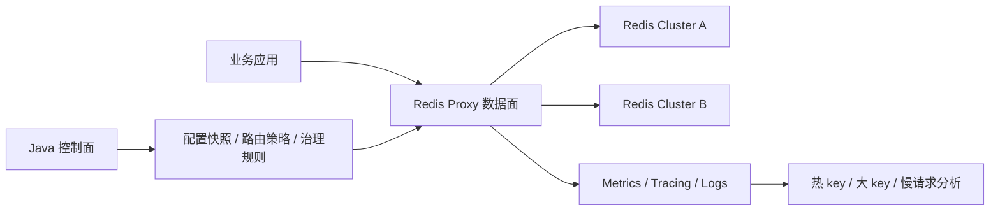

# Redis Proxy 技术方案与实现路线

本项目用于设计和验证一套面向基础架构场景的 Redis Proxy。目标不是简单做透明转发，而是在数据面稳定低延迟的前提下，把 Redis 集群调度、访问治理、观测分析和研发接入规范沉淀到统一入口。

当前工作区保留三套独立工程：

- `redis-proxy-dataplane-go`：Go 数据面，当前作为低尾延迟和低资源开销的主验证方向。
- `redis-proxy-dataplane-java`：Java 21 + Netty 数据面，用于和 Go 在同等能力下做尾延迟、GC、内存和吞吐对比。
- `redis-proxy-control-plane-java`：Java 21 + Spring Boot 控制面，负责配置模型、路由策略、治理规则和后续运维编排。

尾延迟实验工作区说明已独立到 [TAIL_LATENCY_COMPARISON_WORKSPACE.md](TAIL_LATENCY_COMPARISON_WORKSPACE.md)。

## 设计目标

核心目标：

- 对业务隐藏 Redis standalone / cluster / 多集群拓扑差异。
- 支持数据面无状态横向扩容。
- 支持同城双活、自主切换和后续跨机房容灾编排。
- 支持统一鉴权、namespace、限流、命令治理和审计。
- 支持热 key、大 key、大 response、慢请求等访问特征分析。
- 保持低 p99 / p999 尾延迟，避免代理层成为 Redis 访问瓶颈。
- 简化研发接入，形成统一 Redis 使用规范。

非目标：

- 不在数据面承载复杂审批流、报表和策略编排。
- 不在首版实现完整 Redis Server 能力治理，例如完整 Lua / MULTI / PUBSUB 语义拦截。
- 不把热 key / 大 key 离线分析强塞进同步请求路径。

## 总体架构



数据面负责：

- RESP2 请求解析和原始响应转发。
- 连接管理、pipeline 顺序保持、backend 连接池。
- slot 路由、MOVED / ASK 基础处理。
- 快速限流、基础鉴权、命令治理。
- metrics、healthz、readiness、graceful shutdown。

控制面负责：

- cluster / namespace / route / limits 配置建模。
- 生成数据面本地不可变配置快照。
- 管理 routeEpoch 和切换策略。
- 后续扩展审批、发布、灰度、回滚和双活切换编排。

## 数据面技术路线

当前保留 Go 和 Java 双数据面，功能语义对齐后做同口径对比。

Go 数据面：

- 使用标准 `net` + goroutine 模型。
- backend 采用异步连接池，每条 backend 连接维护 FIFO inflight 队列。
- client response sequencer 保证 pipeline 响应顺序。
- 当前本地 benchmark 中，Go async 在同组 async backend 对比里吞吐和 p99 都优于 Java async。

Java 数据面：

- 使用 Java 21 + Spring Boot + Netty。
- Netty 负责前端 TCP 和 backend TCP，不使用 Lettuce/Jedis 进入核心链路。
- 重点验证 direct memory、ByteBuf 生命周期、G1GC / ZGC 下尾延迟差异。
- 当前作为 Java 技术栈下的数据面对照实现，不代表最终生产路线结论。

Rust 路线：

- 暂不进入首轮实现。
- 后续如果 Go / Java 在 p999、内存占用或 CPU 利用率上无法满足目标，再评估 Rust 数据面。
- Rust 适合极致性能和内存控制，但工程团队学习成本、生态集成和迭代效率需要单独评估。

## 路由与集群调度

首版路由能力：

- standalone 单 Redis 转发。
- Redis Cluster slot 计算。
- 简化 slot 到节点映射。
- MOVED / ASK 指标暴露。

后续路线：

1. 接入真实 `CLUSTER SLOTS` 拓扑刷新。
2. 支持 routeEpoch，本地不可变路由快照。
3. 支持按 namespace / key pattern / hash tag 路由到不同集群。
4. 支持灰度切流、按比例切流和快速回滚。
5. 支持同城双活场景下的主读写集群切换。

同城双活建议把“决策”和“执行”分离：

- 控制面负责健康判断、切换计划、审批或自动化策略。
- 数据面只消费已发布的路由快照，按 routeEpoch 原子切换。
- 切换期间优先保证请求路径简单、确定、可观测。

## 治理能力

首版预留配置字段和指标，不把复杂治理放入 MVP 热路径。

后续治理能力分层：

- 接入治理：namespace、应用身份、Redis 资源绑定关系。
- 访问控制：命令黑白名单、只读 namespace、危险命令拦截。
- 限流降级：连接数、QPS、pipeline depth、inflight、请求大小、响应大小。
- 热 key 分析：在数据面做轻量采样和 TopK 近实时统计，重分析放异步链路。
- 大 key / 大 response 分析：同步路径只做大小计数、阈值打点和采样，离线分析由旁路任务完成。
- 审计：高风险命令、跨 namespace 访问、切换操作和异常流量记录。

热 key 和大 key 可以在 Proxy 层做，但需要控制边界：

- 可以做：采样、计数、TopK、阈值告警、按 namespace 聚合。
- 不建议在同步路径做：全量精确统计、复杂聚合、阻塞式大 key 扫描。
- 大 key 更准确的判断应结合 Redis 侧 `MEMORY USAGE`、离线扫描和 response size 观测。

## 统一配置契约

Go / Java 数据面和 Java 控制面共享同一语义配置。

```yaml
server:
  listen: "0.0.0.0:6379"

admin:
  listen: "0.0.0.0:8080"

mode: "cluster"

backends:
  clusters:
    - name: "redis-a"
      nodes:
        - "127.0.0.1:7000"
        - "127.0.0.1:7001"
        - "127.0.0.1:7002"
      pool:
        connectionsPerNode: 16
        maxInflightPerConnection: 4096

routing:
  defaultCluster: "redis-a"
  routeEpoch: 1
  clusterSlotsRefreshIntervalSeconds: 30

limits:
  maxPipelineDepth: 1024
  maxRequestBytes: 10485760
  maxResponseBytes: 104857600
```

配置原则：

- 启动强校验，非法配置 fail fast。
- 数据面运行时使用本地不可变快照。
- 控制面生成同结构配置，后续再支持动态发布。
- 所有切换和治理规则必须可审计、可回滚。

## 本地运行

启动 Redis standalone：

```bash
./scripts/redis-standalone-up.sh
```

启动 Go 数据面：

```bash
./scripts/run-go-dataplane.sh standalone
```

启动 Go 数据面连接本地 Redis Cluster：

```bash
./scripts/run-go-dataplane.sh cluster
```

如果本机 `7000-7005` 端口被占用，可以使用备用端口配置：

```bash
REDIS_CLUSTER_PORTS="7100 7101 7102 7103 7104 7105" ./scripts/redis-cluster-up.sh
./scripts/run-go-dataplane.sh cluster-local
REDIS_CLUSTER_PORTS="7100 7101 7102 7103 7104 7105" ./scripts/redis-cluster-down.sh
```

启动 Java 数据面：

```bash
./scripts/run-java-dataplane.sh standalone g1
./scripts/run-java-dataplane.sh standalone zgc
```

执行 smoke：

```bash
./scripts/smoke.sh
```

执行 benchmark：

```bash
REQUESTS=20000 CLIENTS_LIST="50 200" PIPELINE_LIST="1 10 100" TESTS="set,get" ./scripts/bench.sh
```

使用固定 benchmark profile：

```bash
./scripts/bench-profile.sh smoke proxy
./scripts/bench-profile.sh baseline proxy
./scripts/bench-profile.sh long proxy
./scripts/bench-profile.sh baseline redis-direct
```

profile 语义：

- `smoke`：1000 请求，10 连接，pipeline 1，用于快速验证脚本和资源采集。
- `baseline`：20000 请求，50/200 连接，pipeline 1/10/100，用于本地工程基线。
- `long`：1000000 请求，50/200 连接，pipeline 1/10/100，用于长稳 p99/p999 观察。

执行带资源采集的 benchmark：

```bash
BENCH_TARGET_PID=<proxy-pid> \
BENCH_TARGET_LABEL=go-async \
BENCH_ADMIN_URL=http://127.0.0.1:8080 \
REQUESTS=20000 CLIENTS_LIST="50 200" PIPELINE_LIST="1 10 100" TESTS="set,get" \
./scripts/bench.sh
```

Java 数据面可以额外带上 GC log：

```bash
BENCH_TARGET_PID=<java-pid> \
BENCH_TARGET_LABEL=java-g1-async \
BENCH_ADMIN_URL=http://127.0.0.1:8080 \
BENCH_JAVA_GC_LOG=redis-proxy-dataplane-java/target/gc-g1.log \
./scripts/bench.sh
```

执行直连 Redis baseline：

```bash
REQUESTS=20000 CLIENTS_LIST="50 200" PIPELINE_LIST="1 10 100" TESTS="set,get" ./scripts/bench-direct-redis.sh
```

从多个 benchmark 结果目录生成 Markdown 对比报告：

```bash
./scripts/generate-bench-report.py \
  --title "Redis Proxy Async Backend Comparison" \
  --output bench-results/comparison-$(date +%Y%m%d-%H%M%S).md \
  bench-results/redis-direct-standalone-xxx \
  bench-results/go-async-standalone-xxx \
  bench-results/java-g1-async-standalone-xxx
```

## 验证口径

数据面正确性：

- `PING` / `GET` / `SET` / `DEL`
- pipeline 响应顺序
- 大 value 转发
- 连接关闭与超时
- Redis Cluster slot 计算
- MOVED / ASK 指标
- healthz / readiness / metrics
- graceful shutdown

性能对比：

- 相同 Redis 后端。
- 相同 proxy 配置。
- 相同 client workload。
- 相同机器资源限制。
- 相同并发连接数和 pipeline depth。
- 区分 sync backend 和 async backend 实现模型。
- 同时采集 RPS、p50、p95、p99、p999、CPU、RSS、GC、heap/direct memory、backend inflight 和 error rate。

当前 benchmark 详情见 [TAIL_LATENCY_COMPARISON_WORKSPACE.md](TAIL_LATENCY_COMPARISON_WORKSPACE.md)。

## Redis Backend 异常与 Slot 刷新机制

Backend 到 Redis 集群的异常处理遵循三个原则：

- 快速失败请求，不让 client pipeline 长时间挂起。
- 后台温和修复连接，不在请求路径上无限重试。
- 依赖 Redis Cluster 拓扑信号恢复路由，不因为 TCP 断开直接改 slot owner。

连接异常处理：

- `connect refused`、`connect timeout`、`read EOF`、`write error`、`channel inactive` 都只表示某条 backend connection 不可用。
- backend connection 断开后，当前连接上的 pending 请求快速失败，并继续按 client sequence 占位返回，保证 pipeline 响应顺序不被破坏。
- 已写入 socket 或执行状态不确定的请求不自动重放，避免写命令重复执行。
- backend pool 在后台按退避策略重连，并按原连接槽位替换，保留同一 client/backend 的连接亲和。
- 某个 Redis node 全部连接不可用时，只影响该 node 当前负责的 slot；proxy 不把这些 slot 随机路由到其他 master。

Slot cache 刷新策略：

- TCP 连接断开不触发 slot owner 变更，也不清空 slot cache。
- `MOVED` 是长期拓扑变化信号：立即更新对应单 slot，并触发一次限频异步 `CLUSTER SLOTS` 全量刷新。
- `ASK` 是迁移过程中的临时信号：只做临时转发，不更新长期 slot cache。
- 正常周期刷新默认 30 秒，由 `routing.clusterSlotsRefreshIntervalSeconds` 控制。
- 当某个 master 进入 degraded 状态，例如该 master 全部 backend connection 不可用时，拓扑刷新临时加速到 5 秒；恢复后回到正常周期。
- `CLUSTER SLOTS` 刷新失败时保留旧 slot cache，记录 refresh error，不清空路由表。

健康检查口径：

- `/healthz` 只表示 proxy 进程存活。
- `/readyz` 用于表达数据面是否可承接流量，应检查 slot coverage、backend 可用性和连接池状态。
- 单 master 故障时，proxy 不应整体不可用；对应 slot 快速失败，其他 slot 继续服务。

核心指标口径：

- `backend_active_connections{node}`：按 Redis node 统计健康 backend 连接数。
- `backend_desired_connections{node}`：按 Redis node 统计期望 backend 连接数。
- `backend_reconnecting{node}`：按 Redis node 统计正在调度或执行的重连任务。
- `backend_reconnect_total{node,result}`：按 Redis node 和结果统计重连次数。
- `backend_unavailable_total{node,reason}`：按 Redis node 和原因统计 backend 不可用。
- `backend_inflight{node}`：按 Redis node 统计后端 inflight 请求。
- `cluster_slot_coverage`：slot cache 覆盖数量，正常应为 16384。
- `cluster_slot_refresh_total{result}`：`CLUSTER SLOTS` 刷新成功和失败次数。

## 后续实现步骤

第一阶段：工程基线收敛

状态：进行中。

已完成：

1. Go / Java 数据面的基础单元测试和 smoke 脚本。
2. Go async / Java async 同组 benchmark 基线。
3. 直连 Redis baseline 脚本入口：`scripts/bench-direct-redis.sh`。
4. benchmark 结果报告生成脚本：`scripts/generate-bench-report.py`。
5. benchmark 基础资源采集：CPU、RSS、线程数、admin metrics 快照、Java GC log 摘要。
6. benchmark profile 脚本：`smoke`、`baseline`、`long`。
7. Go runtime metrics：heap、goroutine、process collector，并进入 benchmark 报告。
8. p999 近似采集：long profile 会额外采集 Redis benchmark percentile distribution，并取第一个大于等于 99.9% 的桶。

待完成：

1. Java Netty direct memory 深度指标校准和验证。
2. 固化生产级 benchmark 报告模板和长稳结论口径。

第二阶段：生产级路由

状态：核心能力已完成。`routeEpoch` 原子切换、灰度路由和回滚不纳入本阶段收敛，保留到后续路由发布阶段。

已完成：

1. Go 数据面启动时通过 `CLUSTER SLOTS` 构建 slot cache。
2. Go 数据面按真实 slot cache 路由，不再只使用 `slot % len(nodes)` 简化映射。
3. Go 数据面遇到 `MOVED` 响应时更新单 slot cache，并按需初始化新 backend 连接。
4. Go 数据面支持周期性 `CLUSTER SLOTS` 拓扑刷新，可通过 `routing.clusterSlotsRefreshIntervalSeconds` 配置，`0` 表示关闭。
5. Go 数据面暴露 slot cache 覆盖度、routeEpoch、slot refresh 成功/失败次数和最近成功刷新时间指标。
6. Java 数据面已对齐 `CLUSTER SLOTS` slot cache、周期刷新配置、MOVED 单 slot 更新和路由状态指标。
7. Java 数据面同一 client 到同一 backend 使用稳定后端连接亲和，避免依赖型 pipeline 在多后端连接间执行乱序。
8. Go 数据面同一 client 到同一 backend 也使用稳定后端连接亲和，并补充单元测试锁定该语义。
9. Go 数据面 backend connection 断开后会后台持续重连，并按原连接槽位替换，保留 client/backend 亲和语义。
10. Java 数据面 backend connection 断开后会由独立 scheduler 后台持续重连，限制全局和单 node 重连并发，并按原连接槽位替换。
11. Go / Java 数据面均对齐 Redis backend 异常、`MOVED`、`ASK`、master degraded 和 slot cache 刷新的处理语义。
12. Go / Java 数据面均实现真实 `/readyz`：standalone 检查默认 backend 可用，cluster 检查 slot coverage 和当前 slot owner backend 可用性。
13. Go / Java 数据面均补齐 per-node backend active / desired / reconnecting / reconnect / unavailable / inflight 指标口径。
14. 已完成 Go / Java standalone 停启恢复 E2E：Redis 停止时请求快速失败，Redis 恢复后 proxy 不重启恢复服务。
15. 已完成 Go / Java `7100-7105` cluster-local smoke、master 故障、Redis Cluster failover 和 degraded refresh E2E。
16. 已补充单元测试覆盖 `ASK` 不污染长期 slot cache、`MOVED` refresh 限频触发、backend reconnect 指标不为负和连接槽位替换。

待完成：

1. 支持 routeEpoch 原子切换。
2. 支持灰度路由和回滚。
3. 补充 ASK 临时路由的完整执行语义，例如向临时 owner 发送 `ASKING` 后转发一次请求。
4. 将 cluster failover E2E 固化为可重复脚本，减少手工验证步骤。

第三阶段：治理能力

1. namespace 配置和应用身份接入。
2. 命令治理和危险命令拦截。
3. 基于连接、QPS、pipeline、inflight、请求/响应大小的限流。
4. 热 key 采样 TopK 和大 response 阈值告警。

第四阶段：控制面平台化

1. 配置生成、查询、发布和版本管理。
2. 路由变更审计和回滚。
3. 双活切换策略建模。
4. 与监控告警、CMDB、发布系统集成。

第五阶段：技术路线决策

1. 用长时间压测和真实 workload 对比 Go / Java。
2. 明确 p99 / p999、资源成本、运维复杂度和团队维护成本。
3. 如仍无法满足极致性能目标，再进入 Rust PoC。
