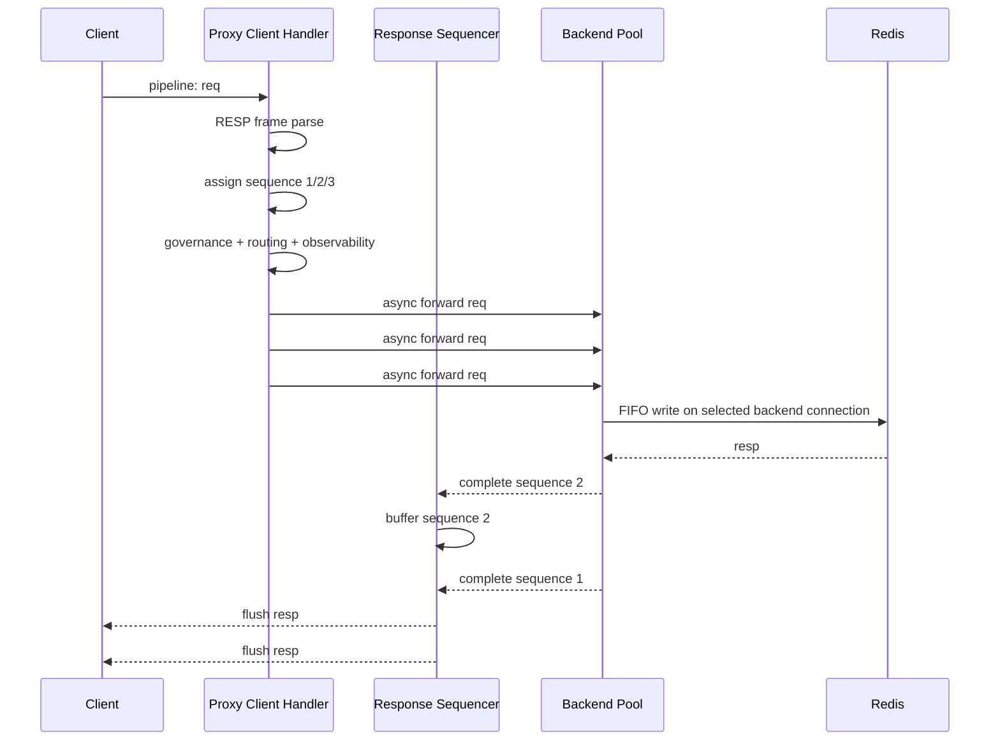

# Redis Proxy Pipeline 处理机制

本文记录当前 Go / Java 数据面对 Redis client pipeline 的处理方式、顺序保证、异常处理和后续优化方向。

## 目标语义

Redis pipeline 的核心要求是：客户端可以在同一 TCP 连接上连续发送多个请求，但响应必须按照请求发送顺序返回。Proxy 因此不能只追求 backend 并发，还必须在 client 侧维护 response sequence。

当前数据面的目标语义：

- 支持同一 client connection 上连续读取多个 RESP2 请求。
- 每个请求独立执行治理、路由、观测和 backend 转发。
- backend 请求可以异步执行，避免把同一 client 的所有请求串行阻塞在后端响应上。
- client 响应必须按原始请求顺序写回。
- 失败请求也必须占位返回，不能让后续响应永久卡住。
- backend 连接异常、`ASKING` retry、`MOVED` 更新都不能破坏 client pipeline 顺序。

## 整体流程



## Go 数据面实现

Go 数据面在每个 client TCP connection 上启动独立 handler。

关键实现：

- `internal/proxy/server.go`
  - 使用 `protocol.ReadRequest` 从 `bufio.Reader` 中逐个读取完整 RESP 请求。
  - 使用递增 `seq uint64` 为每个请求分配 client sequence。
  - 使用 `pending` 计数和 `limits.maxPipelineDepth` 控制 client 侧 pipeline 深度。
  - 使用 `completions chan completion` 接收 backend 异步完成结果。
  - `writeResponses` 维护 `next` 和 `buffered map[uint64]completion`，只按连续 sequence 写回 client。

Go 请求路径：

1. 读取完整 RESP 请求。
2. 分配 `seq`。
3. 增加 client pending 指标。
4. 检查 `maxPipelineDepth`。
5. 执行 `AUTH`、namespace 治理、命令治理、key 治理、观测上下文创建。
6. 按当前 route snapshot 选择 backend cluster / node。
7. 调用 `backend.Pools.DoAsyncAffinity` 异步转发。
8. backend 回调完成后写入 `completions`。
9. writer goroutine 按 sequence 写回响应。

Go backend 处理：

- 每个 backend connection 有独立 write loop、read loop 和 FIFO pending queue。
- 发往同一 backend connection 的请求按 Redis 协议响应顺序匹配。
- `DoAsyncAffinity` 会根据 client affinity 选择稳定 backend connection，减少同一 client pipeline 被拆到不同 backend 连接后的执行顺序风险。
- backend 连接断开时，当前连接上的 pending 请求快速失败，失败结果仍按原 sequence 返回 client。

## Java 数据面实现

Java 数据面基于 Netty pipeline。

关键实现：

- `protocol/RespRequestDecoder.java`
  - 从 Netty `ByteBuf` 中识别完整 RESP2 request frame。
  - 当前使用 `ByteBuf raw + ArgRef offset/length`，避免 parser 阶段把每个 bulk arg 复制为 heap `byte[]`。
- `netty/ProxyChannelHandler.java`
  - 每个 `RespRequest` 进入 handler 后分配 sequence。
  - 执行治理、路由、观测和 backend 异步转发。
  - backend future 完成后回到 client event loop，再提交给 sequencer。
- `netty/ClientResponseSequencer.java`
  - 维护 `nextSequence`、`nextFlushSequence` 和 `TreeMap<Long, PendingResponse>`。
  - 后完成的低序号响应会触发连续 flush。
  - 先完成的高序号响应会暂存在 pending map。
- `backend/BackendPool.java`
  - 每条 backend Netty channel 维护 FIFO pending queue。
  - Redis 响应通过 backend decoder 切成完整 frame 后按 pending queue 匹配。

Java 请求路径：

1. `RespRequestDecoder` 解出完整请求。
2. `ProxyChannelHandler.channelRead0` 分配 sequence。
3. 增加 `redis.proxy.client.pending.responses`。
4. 执行本地 AUTH、治理、namespace / key 限流和观测上下文创建。
5. 使用 `RouteResolver` 选择 backend 地址。
6. 使用 `BackendPool.doRequest` 异步转发 `request.raw()`。
7. backend future 完成后回到 client event loop。
8. `ClientResponseSequencer.complete` 按 sequence 决定立即 flush 或暂存。

## 顺序保证

顺序保证分两层。

第一层是 backend connection FIFO：

- Redis 同一 TCP 连接上响应顺序等于请求顺序。
- Go / Java backend connection 都维护 pending queue。
- backend 读到响应 frame 后，匹配 pending queue 头部请求。

第二层是 client response sequencer：

- client 请求进入 proxy 后即分配单调递增 sequence。
- backend 请求可以异步完成。
- 响应写回 client 前必须经过 sequencer。
- sequencer 只 flush `nextFlushSequence` 对应响应；如果缺失，则暂存后续响应。

这个设计允许 backend 并发，但保留 Redis client pipeline 的响应顺序语义。

## Head-of-line 行为

如果低序号请求变慢，后续高序号请求即使已经完成，也不能提前返回给 client。

示例：

```text
req#1: 慢查询或 backend 节点异常
req#2: 已完成
req#3: 已完成
```

此时 `resp#2` 和 `resp#3` 会缓存在 proxy 的 client sequencer 中，直到 `req#1` 成功或失败并生成占位响应。这个 head-of-line blocking 是 Redis pipeline 顺序语义下必须接受的行为。

因此连接异常处理必须快速失败：

- backend read EOF / write error / channel inactive 时，pending 请求返回 `-ERR backend unavailable`。
- 失败请求占用自己的 sequence。
- 后续已完成响应随后可以继续 flush。

## ASK / MOVED 处理

`MOVED`：

- 数据面把 `MOVED` 响应作为当前请求的最终响应返回 client。
- 同时更新单 slot cache，并限频触发 `CLUSTER SLOTS` 全量刷新。
- `MOVED` 不改变当前 pipeline 的 sequence 规则。

`ASK`：

- 数据面不会直接把第一次 `ASK` 返回 client。
- 对当前请求执行一次 Redis Cluster 协议规定的临时路由：向临时 owner 的同一 backend connection 发送 `ASKING + 原请求`。
- 跳过 `ASKING` 的 `+OK`，把第二个业务响应作为当前 sequence 的最终响应。
- 每个请求最多一次 ASKING retry；二次 `ASK` 直接返回，避免循环。
- ASKING retry 失败时返回 backend unavailable，占位释放后续 pipeline 响应。

## 限制与风险

当前设计仍有几个需要关注的点：

- client 侧 pending buffer 会随 pipeline depth 增长，必须依赖 `maxPipelineDepth` 做保护。
- 如果某个低序号请求长期卡住，会阻塞同一 client connection 后续响应写回。
- 多 key / 多 cluster 路由下，单 client pipeline 可能跨不同 backend 地址，client sequencer 可以保证响应顺序，但 Redis 执行顺序只在同一 backend connection 内有 FIFO 保证。
- 依赖顺序副作用的命令序列，例如 `SET k v` 后立刻 `GET k`，如果路由到同一 key / 同一 backend connection，语义稳定；如果业务在同一 pipeline 中混合多个 key、多个 cluster，需要业务自行理解 Redis pipeline 本身不提供跨连接事务语义。
- Go / Java 都会在 client 侧按当前生效 `maxPipelineDepth` 做硬拒绝；超限请求不进入治理、路由或 backend 转发，但仍占用自己的 sequence 并返回 `-ERR pipeline depth exceeded`，避免后续响应乱序。

## Batch Flush

Go / Java 都支持可配置 client response batch flush：

```yaml
limits:
  pipelineFlushBatchSize: 16
  pipelineFlushMaxDelayMillis: 1
```

语义：

- sequencer 只会批量写出已经连续可 flush 的响应，不会跳过缺失 sequence。
- 达到 `pipelineFlushBatchSize` 后立即 flush。
- 未达到 batch size 时，最多等待 `pipelineFlushMaxDelayMillis` 后 flush。
- `pipelineFlushMaxDelayMillis=0` 表示不等待，基本退化为逐响应立即 flush。
- batch flush 只影响 client 响应写出，不改变 backend 请求发送、ASKING、MOVED 或错误占位语义。

## Backend Affinity

Go / Java 都支持可配置 backend connection affinity：

```yaml
routing:
  backendAffinityStrategy: "client" # client | keySlot | hashTag
```

策略：

- `client`：默认策略，同一 client connection 尽量固定到同一 backend connection。
- `keySlot`：按首个 key 的 Redis slot 选择同一 backend address 下的连接；无 key 请求退化为 `client`。
- `hashTag`：优先按 hash tag 对应 slot 选择连接；无 hash tag 时等价于 `keySlot`，无 key 请求退化为 `client`。
- affinity 只影响同一 backend address 下的连接选择，不改变 cluster、node 或 slot owner 路由结果。

## 指标

相关指标：

| 语义 | Go | Java |
| --- | --- | --- |
| client pending responses | `redis_proxy_client_pending_responses` | `redis.proxy.client.pending.responses` |
| backend inflight | `redis_proxy_backend_inflight` | `redis.proxy.backend.inflight` |
| backend node inflight | `redis_proxy_backend_inflight_by_node{node}` | `redis.proxy.backend.inflight.by.node{node}` |
| request latency | `redis_proxy_request_latency_seconds{command}` | `redis.proxy.request.latency{command}` |
| backend latency | `redis_proxy_backend_latency_seconds{backend}` | `redis.proxy.backend.latency{backend}` |
| namespace inflight | `redis_proxy_namespace_inflight{namespace}` | `redis.proxy.namespace.inflight{namespace}` |
| pipeline buffered responses | `redis_proxy_pipeline_buffered_responses` | `redis.proxy.pipeline.buffered.responses` |
| pipeline flush batch size | `redis_proxy_pipeline_flush_batch_size` | `redis.proxy.pipeline.flush.batch.size` |
| pipeline HOL blocked | `redis_proxy_pipeline_hol_blocked_total{reason}` | `redis.proxy.pipeline.hol.blocked{reason}` |
| pipeline HOL max wait | `redis_proxy_pipeline_hol_max_wait_millis` | `redis.proxy.pipeline.hol.max.wait.millis` |
| MOVED | `redis_proxy_moved_total` | `redis.proxy.moved` |
| ASK | `redis_proxy_ask_total` | `redis.proxy.ask` |

## Debug 与压测

- `/debug/pipeline` 返回进程级 pipeline 摘要：buffered responses、flush 次数、最近和最大 batch size、HOL blocked 次数、最大 HOL wait。
- benchmark metadata 支持记录 `pipeline_flush_batch_size`、`pipeline_flush_max_delay_ms`、`backend_affinity_strategy`。
- benchmark report 会展示 client pending、backend inflight、pipeline buffered 和错误率，便于观察 pipeline depth 1 / 10 / 100 / 1000 下的排队变化。

## 后续优化方向

1. 为 batch flush 增加更细的 per-listener / per-worker 视角，定位 event loop 局部热点。
2. 在压测报告里补充 HOL wait 分位数，目前只保留最大值和阻塞计数。
3. 结合业务命令类型，为依赖型 pipeline 增加治理告警，提示跨 key / 跨 cluster pipeline 的顺序风险。
